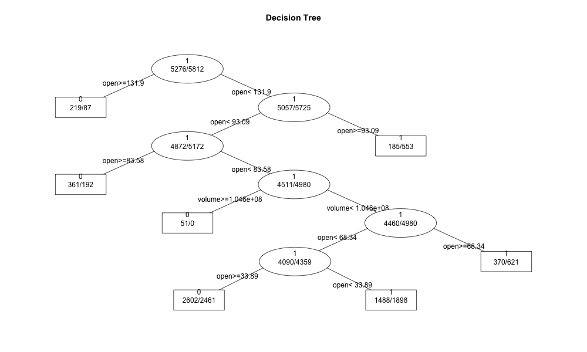

```{r setup, include=FALSE}
knitr::opts_chunk$set(echo = FALSE)
```

```{r, include=FALSE}
library(knitr)
library(kableExtra)
library(bestglm)
library(car)
library(caret)
library(corrplot)
library(dplyr)
library(ggplot2)
library(ISLR)
library(MASS)
library(Metrics)
library(MLmetrics)
library(pROC)
library(pscl)
library(rattle)
library(RColorBrewer)
library(ResourceSelection)
library(rattle)
library(rpart)
library(rpart.plot)
library(ROCR)
library(tree)
library(verification)
```

##Research Question {.bigger}

<font size = "6.5">**Can a combination of news and market data predict whether a company's stock will increase or decrease within a day?**</font>

##Data Source {.centered}

```{r, out.width="75%"}

```

**18 variables & 13860 observations**

```{r, include=FALSE}
#read in data 
df <- read.csv('data.csv') 
#remove X column
df$X <- NULL 
#check data
str(df)
#change data types
df$binary_result <- as.factor(df$binary_result)
df$sentimentClass <- as.factor(df$sentimentClass)
df$urgency <- as.factor(df$urgency)
#check data
str(df)
```

##Data Preparation {.smaller}

```{r}
head(df)%>%
kable()%>%
kable_styling(c("striped", "hover", "condensed", "responsive")) %>%
scroll_box(width = "100%")
```

##Exploratory Data Analysis {.smaller}

```{r}
#correlation matrix
dfCorrMatrix <- cor(df[, c(4:7, 11:13, 15:18)], method = "pearson")
#correlation plot 
corrplot(dfCorrMatrix, method = "square", addCoef.col = "black", number.cex = 7/ncol(df))
```

##Test/Train {.bigger}

**Remove highly correlated features**

**Split data for models**

-80% train

-20% test

```{r, include=FALSE}
#create df w/o highly correlated features
dfModel <- df[, c(4:5, 8:16)]
#get 80% train
train <- dfModel[1:11088, ]
#get 20% test
test <- dfModel[11089:13860, ]
```

##Models

**Stepwise logistic regression**

**Decision tree**

##Decision Tree {.centered}

```{r, out.width ="80%", out.height="80%"}
#decision tree
set.seed(1)
tree <- rpart(binary_result ~ volume + open + provider + sentimentClass + sentimentNegative + sentimentNeutral + sentimentPositive + urgency + firstMentionSentence + bodySize, data = train, control = rpart.control(maxdepth = 6), method = "class")
#decision tree visualization

```

##Conclusion {.bigger}

**For both models, open and volume were important variables**

**Accuracy for stepwise logisitc regression was 47.40%, while decision tree was 49.06%**

**News and market data were terrible predictors of stock movements** 
